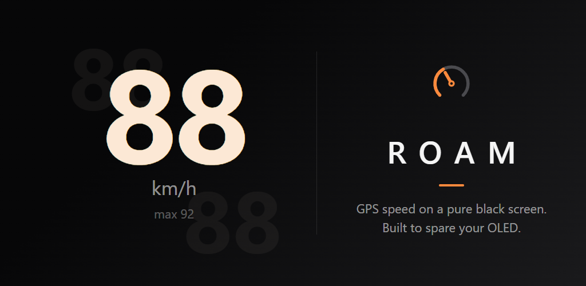
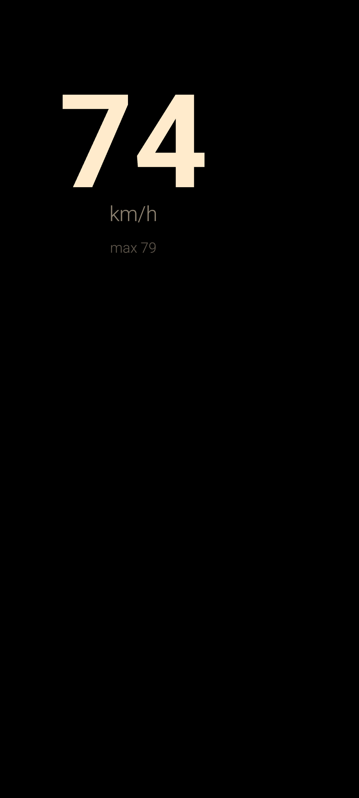
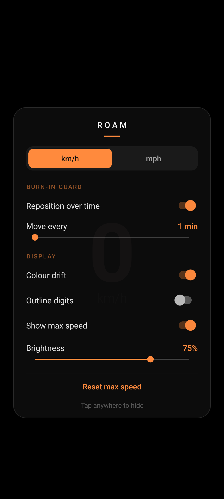
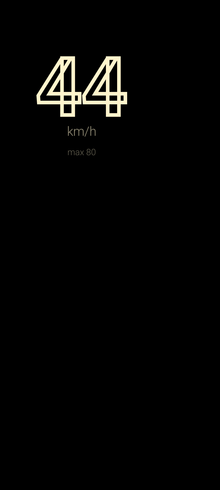

# Roam

A GPS speedometer for Android that treats your OLED with respect.



Most people who want a speed readout in the car just open Google Maps and leave it on. That works, but hours of a bright, static UI is exactly how OLED panels burn in. Roam shows one thing, your current GPS speed, on a pure black screen, and is built from the ground up to leave no trace on your panel.

## How it protects your screen

- **The readout moves.** Every few minutes (1 to 10, your choice) the speed display glides to a new position. Positions are chosen so consecutive spots land far apart and the whole screen gets used evenly over a drive.
- **Pure black background.** On OLED, black pixels are off. Only the digits are lit.
- **Colour drift.** The digit colour slowly shifts hue so no single subpixel carries the whole load.
- **Outline digits.** Optional hollow digit style that lights a fraction of the pixels.
- **Brightness control.** Dim the display from inside the app without touching system settings.

## The rest

- Current speed in km/h or mph, plus a session max
- Screen stays awake while the app is open
- No ads, no tracking, no network access at all. The only permission is location, used for GPS speed.
- Tiny: the APK is well under 100 KB

| | | |
|---|---|---|
|  |  |  |

## Install

Grab the latest APK from [Releases](../../releases), or build it yourself:

```
./gradlew assembleDebug
```

Requires JDK 17+ and the Android SDK.

## Releasing

Tag a version and push it. GitHub Actions builds the signed APK and AAB and attaches them to a GitHub release:

```
git tag v1.1.0
git push origin v1.1.0
```

## License

[AGPL-3.0](LICENSE)
